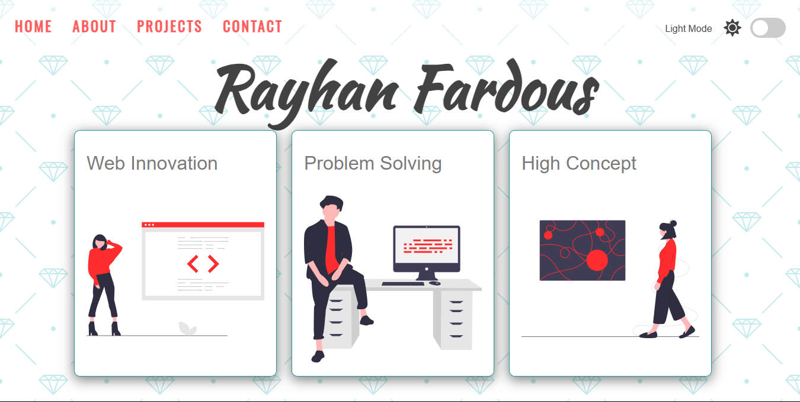
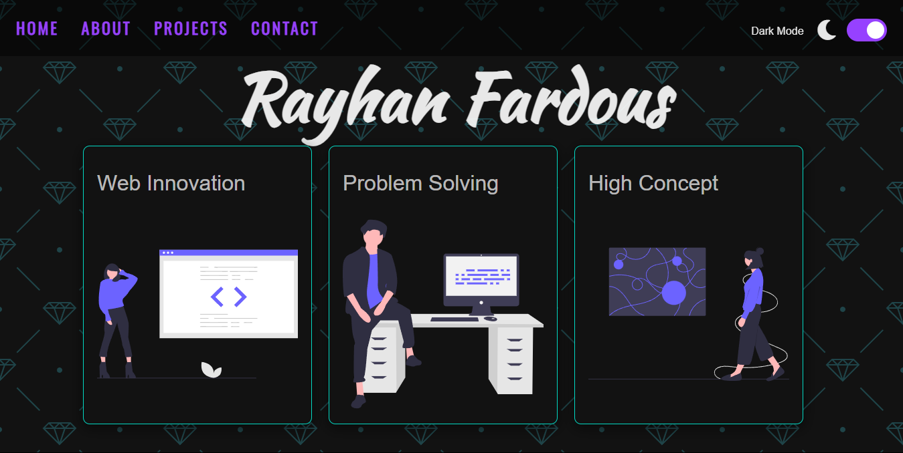

# Dark/Light Theme Toggle

A simple JavaScript project that demonstrates how to implement a dark/light mode switch using vanilla JavaScript, CSS, and HTML. The theme preference is saved using `localStorage` so it persists between page reloads.

## 🌗 Features

- Toggle between light and dark themes
- Smooth UI changes (background colors, text, and icons)
- Dynamically change images based on the theme
- Theme preference is saved in `localStorage`
- Uses Font Awesome for theme icons

## 🛠️ Technologies Used

- HTML5
- CSS3
- JavaScript (ES6)

## 📁 Project Structure

```
/light-dark-mode
│
├── favicon.png
├── index.html
├── README.md
├── style.css
├── script.js
└── /img
    ├── light_mode.png
    ├── dark_mode.png
    ├── undraw_proud_coder_light.svg
    ├── undraw_proud_coder_dark.svg
    ├── undraw_feeling_proud_light.svg
    ├── undraw_feeling_proud_dark.svg
    ├── undraw_conceptual_idea_light.svg
    └── undraw_conceptual_idea_dark.svg
```

## 📸 Screenshots

### Light Mode


### Dark Mode


## 🚀 Getting Started

1. Clone the repository:

```bash
git clone https://github.com/rayhan-fardous/light-dark-theme.git
```

2. Navigate to the project directory:

```bash
cd dark-light-mode
```

3. Open `index.html` in your browser.

## ✨ Customization

- Replace the SVG images in the `/img` folder with your own images using the same naming convention.
- Customize the colors in the CSS file to match your branding.

## 📌 Note

Make sure you include the Font Awesome library in your HTML for the icons to work:

```html
<link rel="stylesheet" href="https://use.fontawesome.com/releases/v5.15.4/css/all.css">
```

## 🖼️ Demo
You can host this project, Example:

- [Visit Now!](https://rayhan-fardous.github.io/light-dark-theme/) 🚀
